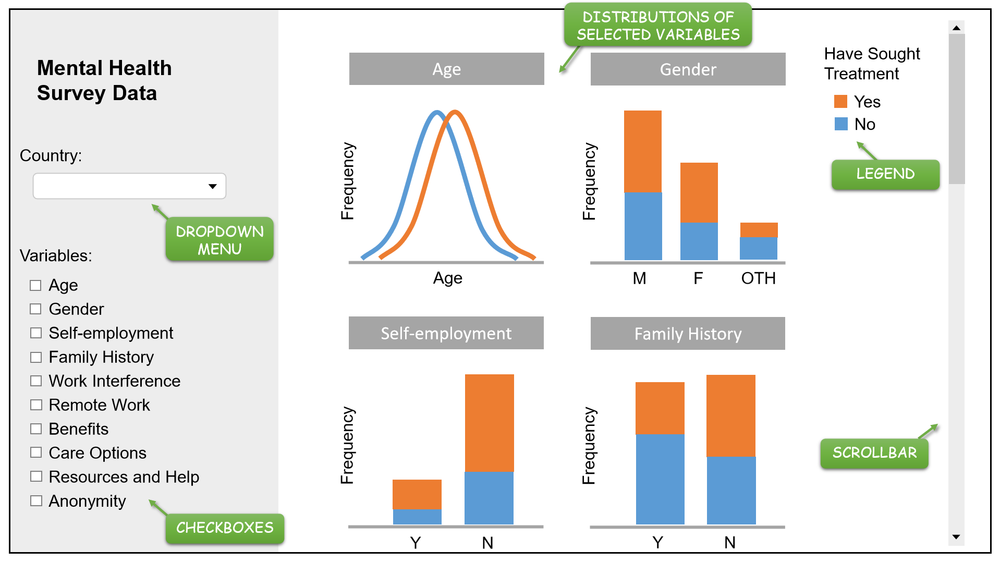

# DSCI_532_Mental-Health-in-Tech-Workplace

**Team Members:**

- Sabrina Kakei Tse (github id:sabrinatkk)

- Pan Ting (githubid:panntingg)

## Section 1 - Overview

Problem: What purpose does our App serve?

Maintaining mental wellness of employees is critical to a company's success as it directly affects productivity, morale, and public perception of the company in the long run. It is employers' responsibility to create an open and comfortable work environment for employees to express mental health concerns, as well as providing sufficient health care to address those concerns. With that in mind, we proposed a data visualization application that aims to help human resource researchers to understand general attitudes towards mental health in workplace from both employees and self-employers across the world. The visualization includes distributions of factors that may contribute to the likelihood of individuals seeking help and receiving treatments. With a built-in sidebar, users can explore different sub-groups within people who have sought mental health treatment and those who have not by filtering variables of interest.

## Section 2 - Data Description

The dataset we use is Mental Health in Tech Survey(https://www.kaggle.com/osmi/mental-health-in-tech-survey), which is from a 2014 survey that describes the respondent and measures their attitudes towards mental health in the tech workplace. It contains 27 variables, and we choose 11 variables according to the purpose of our App:

- Personal information of the respondent who did the survey (age, gender, country);
- If the respondent has a family history of mental illness (family_history);
- If the respondent have sought treatment for a mental illness (treatment);
- Work status of the respondent (self_employed, remote_work)
- If the mental health condition interferes the work (work_interfere);
- Related policies of the employer (benefits, care_options, seek_help);
- If the respondent is anonymity protected of mental health treatment (anonymity).

Note that we only apply data of several countries (about 10), to ensure we have enough observations for each country to explore.

## Section 3 - Usage scenario & tasks

Polly is a human resource consultant who works at a leading global technology company. The result of her latest employee satisfaction survey shows that on average, employees have become less happier and more depressed than they were three years ago.
The HR data also shows that the number of both sick leaves and personnel conflicts and complaints have increased significantly, in addition to the increasing numbers of bad online reviews on the company for being negative, stressful and having insufficient mental support in major job-hunting websites.
Polly's current focus is to customize the corporate mental health support system by redesigning the current health plan and creating a positive, supportive and comfortable environment for employees from all branches around the globe.
Before she can do all of that, she uses the HR data visualization site to aid her on the designing process.  Polly can control the visualization content by maneuvering the settings on the sidebar. By doing so,  the visualization application provides an overview of attitudes towards mental health in different countries, age groups, gender and work status and more.
By understanding the differences in these sub-groups, she can create several health care options to serve different segments within the company. In addition, the application also allows Polly to understand what factors contribute to an open environment for employees to discuss mental health issues in workplace.
Polly understands that employees are less stressed if they can openly talk about or admit their mental complications in workplaces without consequence but only support. The app shows how availability of mental health support resources and benefits correlates to  how likely a person seeks help or receive mental treatment. With this final piece of information, Polly can now create a cultural change strategy with improved benefits to alleviate absenteeism and improve public perception.

## Section 4 - Description of the app & sketch

Our app contains a landing page that shows the distribution of the all our data without any filter,  including all the factors we interest (age, gender, self_employed, family_history etc.). The plots (bar chart, density chart etc) are based on the data type of each variable. All the plots are colored according to whether the respondent have sought treatment for a mental illness or not (treatment), and there is a legend indicating what each color represented to help users understand. From a dropdown list, users can filter data by country, showing the distributions of the specified country. In addition, users can choose variables they interest from the checkboxes, to show the distributions of the selected variable(s). If more plots are available, users can see them by scrolling down.

Here is the sketch of our app:

