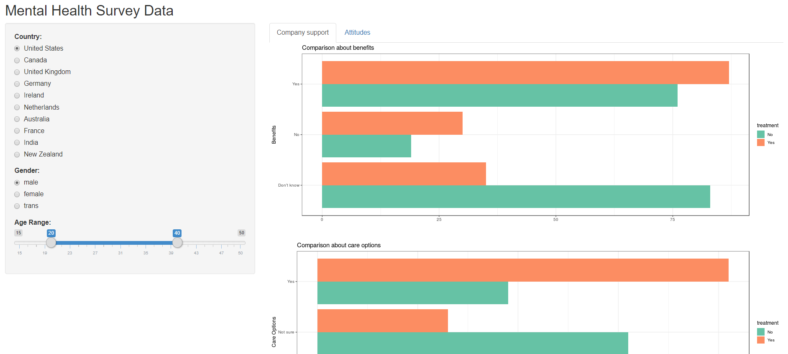

# Milestone 2: Application Development

## Mission

A simple-to-use application that presents customized segmentations using mental health data.

Details:

- to help human resource researchers to understand general attitudes towards mental health in the workplace from both employees and self-employers across the world. 

- The visualization includes graphical presentation of data from factors that may contribute to the likelihood of individuals seeking help and receiving treatments. 

- Customizable - Users can explore different sub-groups within people who have had mental health treatment and those who have not by filtering variables of interest.

## User Interface - Design

Our application interface has three components:

 - **Left** : Control bar for filtering the data
     - Rationale: This allows users to customize the graphic presentation on the right hand side. Users can filter by country, gender and age, which are the three main 
 - **Right**: Visualization by variables
     - Rationale: Bar graph is our main choice for data visualization as it is the most intuitive graph for users. The bar graph varies depending on the number of observations within the segmentation produced by users'preference from the left control bar.
     - Colour
 - **Tabs**: Visualization by areas of interest
     - Rationale: Having the "Corporate Support" and "Attitude" tabs allow users to explore the availability of corporate resources and how they influence the receipt of mental health treatment.

## Data Abstraction 

Our application focuses on showing differences in the general attitude of different segmentations towards the corporate mental health issues. Our application breaks down the data by the following hierachy:

**Top layer**  - "Treatment = yes or no"
   - not customizable
   - The overarching grouping in this application is presented in two different colours. Orange means the group has sought mental health treatment; green indicating that the group has never sought treatment.

**Second layer** - demographics
 - Countries :
     We have limited the country filter choices to only those that have more than 10 observations. There are in total 10 countries available for selection.
 - Gender :
    We have cleaned up the survey result to have three groups - Male, female and transgender. (click [here](https://github.com/UBC-MDS/DSCI_532_Mental-health-survey-Tech/blob/master/src/tidy_data.R) for the data cleaning script)
 - Age :
    This is presented in range so users can choose the range to segment.

 **Final layer** - areas of interest

- Variables under "Corporate Support" 
    - "Benefits", indicating whether the company has mental health benefits
    - "Care options",indicating whether the employees know about the mental health care options provided at work
    - "Wellness program", indicating whether the individual has discussed about mental health wellness program with their employer.
    - "Education", whether the employer has provide resources to learn more about mental health issues and how to seek help.
  
- Variables under "Attitude" tab
    - "Mental health interview" and "physical health interview", indicating if the individaul would bring up such topics with potential employer in an interview
    - "Mental health consequence" and "physical health consequence", indicating wthere the individual feels comfortable discusing such issues without perceived negative consequeneces
    - "Discussion with coworkers" and "discussion with supervisors", indicating to which audience the individual is willing to talk about mental health issues.

## Development process and challenges

Our vision has changed sightly during the development of the first application draft. Originally, we envisioned to show a world map in the front page to present all data available to us. However, many countries in the raw dataset do not have sufficient observations with many countries having only one survey response, so we limited our visualization to only 10 countries to provide users with more meaningful information.

Our next challenges are time and limited knowledge at this point. Due to the limited time we have to develop the first draft of the application, there are areas of improvement we can work on if we are given sufficient time to explore and develop more functions of the app. For example, we would like to 

   - add hover pop-up windows on the variables to show original survey questions.
    
   - put in more pleasing colours on the interface
   